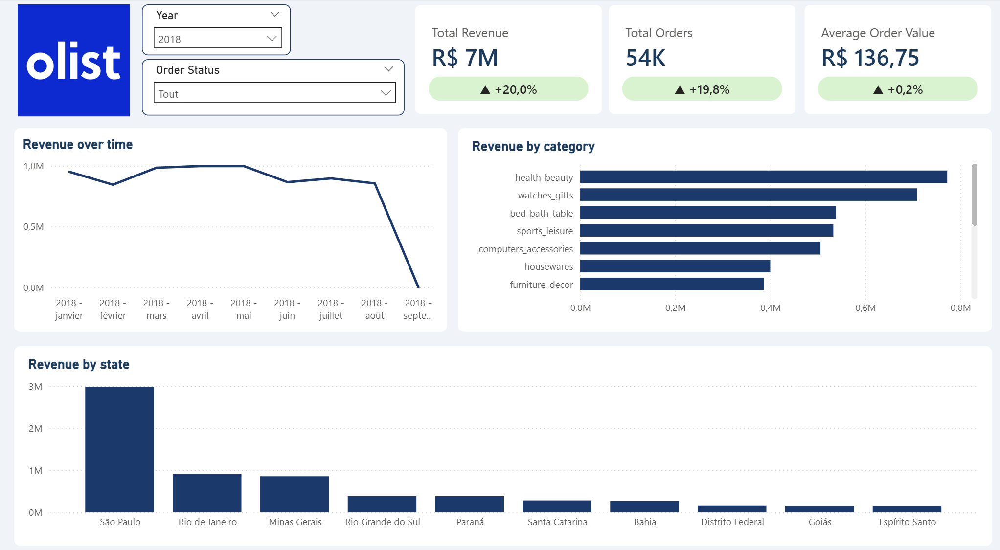
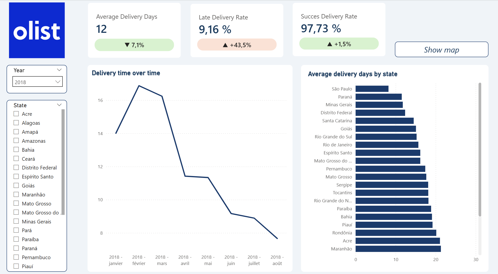
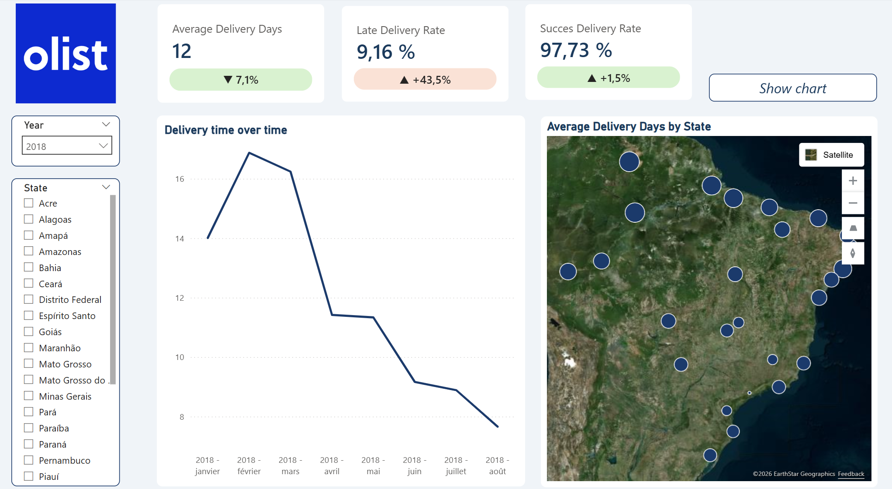
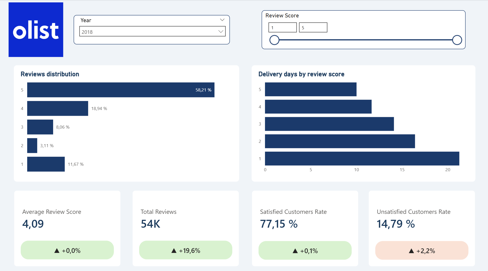
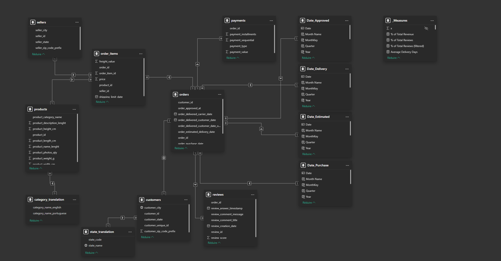

# Analyse e-commerce Olist - Dashboard Power BI

Données Kaggle - Marché brésilien - 2017-2018

## Le projet

Analyse de plus de 100 000 commandes sur la marketplace brésilienne Olist à partir d'un dataset de 9 tables (modèle en flocon de neige). L'objectif était d'identifier les leviers d'amélioration de la satisfaction client.

Ce dashboard Power BI s'étend sur 3 pages : la vue générale des ventes, la performance des livraisons et la satisfaction client. Chaque page intègre une comparaison year-over-year sur l'ensemble des KPIs.

## Aperçu du dashboard

**Page 1 — Vue générale des ventes**

**Page 2 — Analyse des livraisons (vue barres)**

**Page 2 — Analyse des livraisons (vue carte)**

**Page 3 — Satisfaction client**

**Modèle de données — Schéma en étoile**

## Analyse

### 1. Vue d'ensemble du business

Olist a généré **6M R$** en 2017 et **7M R$** sur les 8 premiers mois de 2018, soit une croissance de **+16,7%** sur une période comparable.

La concentration géographique semble marquée : **São Paulo représente 37% du revenue total** (2,2M R$), suivie de Rio de Janeiro (906K R$) puis par Minas Gerais (723K R$). Ces trois états du Sud-Est concentrent l'essentiel de l'activité.

Concernant les catégories, **Health Beauty monte de la 3ème à la 1ère place** entre 2017 et 2018 (7,83% → 10,46% du revenue) dépassant Bed Bath Table et Watches Gifts. Il s'agit d'un signal fort d'une tendance de fond sur ce marché.

### 2. Logistique

Le délai moyen de livraison est passé de **13 jours en 2017 à 12 jours en 2018**. Cela est la preuve d'une amélioration réelle au niveau national mais qui demeure insuffisante au niveau régional ou local :

- Roraima : 32 jours — Amapá : 29 jours — Amazonas : 26 jours
- São Paulo : 9 jours — Minas Gerais : 12 jours — Paraná : 12 jours

En résumé, un client à Roraima attend **3,5 fois plus longtemps** qu'un client à São Paulo.

De plus, le **taux de retard a augmenté de +43,5% (6,38% → 9,16%) malgré la réduction du délai moyen**. Ainsi, les livraisons rapides sont devenues plus rapides mais les retards se sont aggravés.

### 3. Satisfaction client

Le score moyen se stabilise autour de **4,09/5** étoiles, avec 57% de notes 5 étoiles. 
Cependant, il semble nécessaire de relever la quasi corrélation entre le délai de livraison et la satisfaction client :

| Note | Délai moyen (2017) |
|------|--------------------|
| 1★   | 21,15 jours        |
| 2★   | 16,79 jours        |
| 3★   | 14,27 jours        |
| 4★   | 12,87 jours        |
| 5★   | 11,31 jours        |

Chaque étoile supplémentaire correspond à environ **2,5 jours de livraison en moins**. Le seuil critique semble se situer autour de 13-14 jours : en dessous, les clients donnent majoritairement des notes de 4 à 5 étoiles et au-delà, les notes chutent significativement. C'est d'ailleurs précisément le délai moyen national en 2017, ce qui pourrait expliquer les 14,46% de clients insatisfaits.

### 4. Recommandations

**Réduire les délais dans les états du Nord** — Roraima, Amapá et Amazonas cumulent les pires délais de livraison et sont probablement surreprésentés dans les avis d'une étoile. Améliorer la logistique dans ces régions pourrait avoir un double impact : une réduction des insatisfactions client et une ouverture vers un marché sous-exploité.

**Surveiller le taux de retard** — La hausse de +43,5% en 2018 est un signal d'alerte. En effet, si la tendance se confirme sur le second semestre, elle risque de dégrader le score moyen malgré la croissance des volumes de ventes.

**Capitaliser sur Health Beauty** — La progression de cette catégorie (+2,63 points en un an) représente une opportunité de développement ciblé.

## Stack

- Power BI Desktop
- DAX (mesures YoY, taux de livraison, score moyen)
- Dataset : [Olist Brazilian E-Commerce — Kaggle](https://www.kaggle.com/datasets/olistbr/brazilian-ecommerce)

## Auteur

**Marie NEAU** — Data Analyst  
[LinkedIn](https://linkedin.com/in/marieneau)
